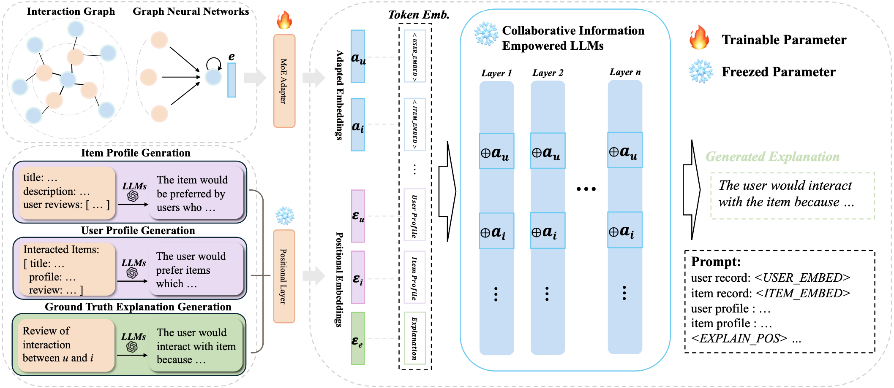

# XRec: Large Language Models for Explainable Recommendation

This paper presents a model-agnostic framework, **XRec**, that integrates the graph-based collaborative filtering framework with Large Language Models (LLMs) to generate comprehensive explanations for recommendations. By leveraging the inherent collaborative user-item relationships and harnessing the powerful textual generation capabilities of LLMs, XRec establishes a strong connection between collaborative signals and language semantics through the utilization of a Mixture of Experts (MoE) adapter.

<p align="center">

</p>

## Environment

Run the following command to install dependencies:

```
pip install -r requirements.txt
```

## Datasets

We utilize three public datasets: Amazon-books `amazon`, Google-reviews `google`, Yelp `yelp`.User/item profile and explanations for each dataset are provided in `data/{dataset}/data.json`.To generate user/item profile and explanations from scratch, enter your **OpenAI API Key** in line 7 of these files: `generation/{item_profile/user_profile/explanation}/generate_{profile/exp}.py`.

- **Item Profile Generation**:
  ```
  python generation/item_profile/generate_profile.py
  ```
- **User Profile Generation**:
  ```
  python generation/user_profile/generate_profile.py
  ```
- **Explanation Generation**:
  ```
  python generation/explanation/generate_exp.py
  ```

## Usage

Each of the below commands can be run independently, since the finetuned LLM and generated explanations are provided within the data. Prepare your **Hugging Face User Access Token** for downloading Llama 2 model.

- To finetune the LLM from scratch:
  ```
  python explainer/main.py --mode finetune --dataset {dataset}
  ```
- To generate explanations:
  ```
  python explainer/main.py --mode generate --dataset {dataset}
  ```
- To see sample generated explanations:
  ```
  python explainer/sample.py --dataset {dataset}
  ```
- To evaluate generated explanations:
  ```
  python evaluation/main.py --dataset {dataset}
  ```

Supported datasets:  `amazon`, `google`, `yelp`

## Code Structure

```
├── README.md
├── data (amazon/google/yelp)
│   ├── data.json                         # user/item profile with explanation
│   ├── trn/val/tst.pkl                   # separation of data.json
│   ├── total_trn/val/tst.csv             # user-item interactions
│   ├── user/item_emb.pkl                 # user/item embeddings
│   ├── user/item_converter.pkl           # MoE adapter
│   ├── tst_pred.pkl                      # generated explanation
│   └── tst_ref.pkl                       # ground truth explanation
├── encoder
│   ├── models                            # graph neural network (GNN) structure
│   ├── utils
│   └── train_encoder.py                  # derive user/item embeddings
├── explainer
│   ├── models
│   │   ├── explainer.py                  # XRec RecExplainer model
│   │   └── modeling_explainer.py         # modified PyTorch LLaMA model
│   ├── utils
│   ├── main.py                           # employ XRec                
│   └── sample.py                         # see samples of generated explanations
├── generation
│   ├── instructions                      # system prompts for user/item profile and
│   ├── explanations
│   ├── item_profile                      # generate item profile
│   │   ├── item_prompts.json
│   │   ├── item_system_prompt.json
│   │   └── generate_profile.py
│   ├── user_profile                      # generate user profile
│   │   ├── user_prompts.json
│   │   ├── user_system_prompt.json
│   │   └── generate_profile.py
│   └── explanation                       # generate ground truth explanation
│       ├── exp_prompts.json
│       ├── exp_system_prompts.json    
│       └── generate_exp.py
└── evaluation
    ├── main.py
    ├── metrics.py               
    └── system_prompt.txt                  # system prompt for GPTScore
```
